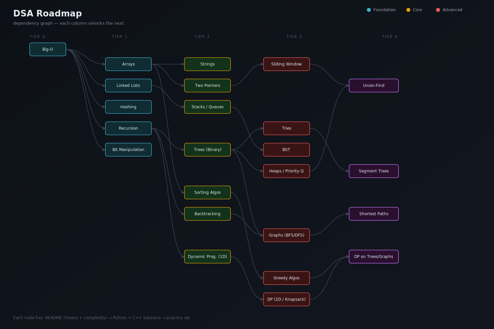

# DSA Roadmap

A structured, from-scratch path through Data Structures & Algorithms — built to take you from zero to interview-ready. Every topic includes a plain-English explanation, complexity analysis, annotated solutions in **Python and C++**, and a curated practice set.

This isn't a link dump. Each folder is written so that reading the `README.md` and solutions in order should genuinely teach you the topic, not just show you code.



## How to use this repo

1. Go in order. The diagram above is a dependency graph — each tier assumes you're comfortable with the tier before it.
2. For each topic: read the `README.md` first (concept + complexity), then work through the problems in `problems/` *before* looking at the solutions.
3. Re-implement each solved problem from scratch in both languages once you understand it. Reading a solution and being able to write it are different skills.
4. Check off topics in the progress tracker below as you go.

## Progress Tracker

### Tier 0 — Foundation
- [ ] [Big-O Notation](./01-big-o-notation)

### Tier 1 — Core Building Blocks
- [ ] [Arrays](./02-arrays)
- [ ] [Linked Lists](./03-linked-lists)
- [ ] [Hashing](./04-hashing)
- [ ] [Recursion](./05-recursion)
- [ ] [Bit Manipulation](./06-bit-manipulation)

### Tier 2 — Core Patterns
- [ ] [Strings](./07-strings)
- [ ] [Two Pointers](./08-two-pointers)
- [ ] [Stacks & Queues](./09-stacks-queues)
- [ ] [Binary Trees](./10-binary-trees)
- [ ] [Sorting Algorithms](./11-sorting)
- [ ] [Backtracking](./12-backtracking)
- [ ] [Dynamic Programming — 1D](./13-dp-1d)

### Tier 3 — Intermediate
- [ ] [Sliding Window](./14-sliding-window)
- [ ] [Tries](./15-tries)
- [ ] [Binary Search Trees](./16-bst)
- [ ] [Heaps / Priority Queues](./17-heaps)
- [ ] [Graphs — BFS/DFS](./18-graphs-traversal)
- [ ] [Greedy Algorithms](./19-greedy)
- [ ] [Dynamic Programming — 2D / Knapsack](./20-dp-2d)

### Tier 4 — Advanced
- [ ] [Union-Find (Disjoint Set)](./21-union-find)
- [ ] [Segment Trees](./22-segment-trees)
- [ ] [Shortest Path Algorithms](./23-shortest-paths)
- [ ] [DP on Trees & Graphs](./24-dp-advanced)

## Structure of each topic folder

```
NN-topic-name/
├── README.md          concept explanation, when to use it, complexity, pitfalls
├── python/
│   └── *.py           annotated solutions
├── cpp/
│   └── *.cpp           annotated solutions
└── problems.md         practice set, ordered easy -> hard, with links
```

## Contributing

Found an error, or want to add a cleaner explanation or an alternate solution? PRs are welcome — please match the existing README format for the topic so the roadmap stays consistent.

## License

MIT — use this freely for your own learning or teaching.
